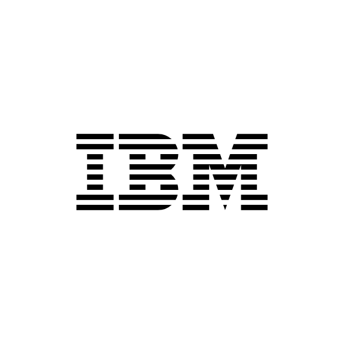

<h1>
  
  IBM NOC ASSISTANT HELM PACKAGES
</h1>

## Table of Contents
- [IBM TME-CoE Telco AI Assistant Package](#telco-AI-Assistant-package)
- [Supported Hosting Platform](#supported-hosting-platform)
- [Pre-Requisites](#pre-requisites)
  * [Access](#access)
  * [Platform Capacity](#platform-capacity)
  * [SCC Commands to be executed](#scc-commands-to-be-executed)
- [Loading Images to Repository](#loading-images-to-repository)
- [Installation Instruction](#installation-instruction)

# IBM TME-CoE Telco AI Assistant Package
This has 14 components
* MongoDB Database to store the instance configuration data.
* Keycloak - Oauth and IAM Server.
* Postgres - For Keycloak and user data Database.
* Service - Java API.
* Bff - Backend for front-end UI application.
* UI - React JS.
* Logstash - ETL Tool to ingest the data.
* Telco Assistant - Primary Telco NOC AI Assistant Asset backend service.
* Sleepingcell-backend -Telco NOC AI Assistant Asset Assistant for sleepingcell usecase.
* Topology-analysis -Telco NOC AI Assistant Asset Assistant for Topology analysis usecase.
* Easement-qa -Telco NOC AI Assistant Asset Assistant for Easement QA usecase.
* Image-topology -Telco NOC AI Assistant Asset Assistant for Image Topology usecase
* Milvus - Vector database.
* Conversation - Storing and fetching the user conversations.

# Supported Hosting Platform
Client package can be installed on any cloud which supports kubernetes. Helm chart packages all the component of this asset

# Pre-Requisites
## Access
* A general deployer access (which can create pv, pvc, routes ..etc) to the hosting platform is    sufficient    to deploy this client package.
* Connectivity to https://github.ibm.com/ to pull necessary scripts
* Connectivity to docker repository to load the necessary docker images
* SAML Configuration (Optional) details such as Client_id and Client_Secret - This is needed to enable external authentication else local authentication will be used

### Infra requirements

| **Category**           | **Details**                                         |
|-----------------------|-----------------------------------------------------|
| **Cluster / CaaS**    | Redhat OpenShift / EKS / Kubernetes     |
| **Worker spec**              | 16 vCPU, 48 GB RAM, 500 GB primary storage        |
| **Worker count**            | 3                                                   |

## SCC Commands to be executed
Following scc shall be provided to the below listed service accounts, for which admin priviledges are needed.

* **For vz-ibm-genai:**
oc adm policy add-scc-to-user anyuid -z tme -n openshift-namespace
* **For mongodb:**
oc adm policy add-scc-to-user anyuid -z tme-mongodb -n openshift-namespace
* **For keycloak:** 
oc adm policy add-scc-to-user anyuid -z tme-keycloak -n openshift-namespace
* **For keycloak postgres:**:
oc adm policy add-scc-to-user anyuid -z default -n openshift-namespace
* **For tme postgres:**:
oc adm policy add-scc-to-user anyuid -z tme-data-postgresql -n openshift-namespace

# Loading Images to Repository

The installation of this asset requires access to image repository which hosts the asset container images
* Download the archive from the box link https://ibm.box.com/s/lfx825kz400yhcsfffaomksp0emyxhmi
* Upload the archive to the bastion node which has access to Kubernetes cluster
* Extract the archive and load the images

```
tar -zxf image-archive.tar
cd image-archive
chmod +x image-push.sh
./image-push.sh <image-repo-path/vz-ibm-genai>
```

# Installation Instruction

The basic steps needed to install IBM TME-CoE Telco AI Assistant are:
* Make sure you have access to create PV (Persisten Volume). Run the below command.
* Download the package from https://github.ibm.com/TME-CoE/helm-packages
* Install the chart,this will instantiate all the components of IBM TME-CoE Telco AI Assistant.

Command to install

**Production Deployment**
```
helm install tme . --set global.ingress=<< INGRESS VALUE FOR YOUR CLOUD >> \
--set global.repository=<< Local image repository >> --set global.route.with_ns=false \
--set global.environment=dev --set global.cloudplatform=true --set global.iamrole=<< IAM ARN Value >>
```

* Following parameters **but not limited to**, can be passed for controlling the values of the chart
   * To select the environment variables based on cluster environment. For Development (dev), Production (prod)
     **--set global.environment=latest or dev or test or prod**
   * To include the openshift projectname(namespace) in the URL of ICTE UI
     **--set global.route.with_ns=true**
   * To select deployment type, Can be on-prem or on cloud
     **--set global.cloudplatform=true**  

Check the installation status
```bash
helm list
NAME    NAMESPACE       REVISION        UPDATED                                 STATUS          CHART           APP VERSION
tme     tme             1             2024-10-10 11:16:32.207159969 +0000 UTC   deployed        tme-1.0.0       1.1
```
